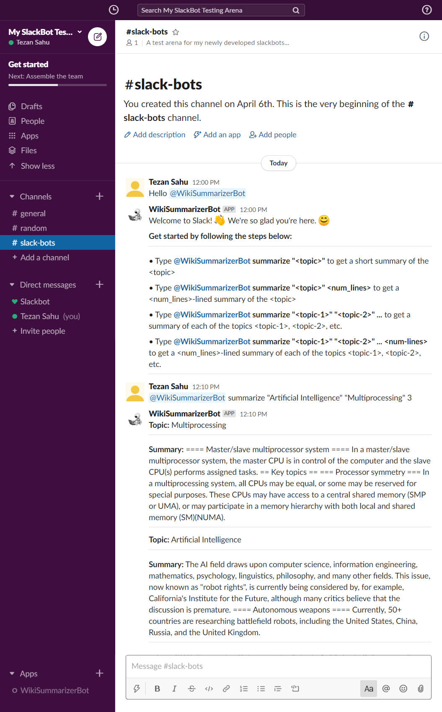

<p style="text-align:center"></img></p>
<h1 style="text-align:center; margin-top:-10pt">Wiki Summarizer Slack Bot</h1>
<p style="text-align:center">
    </img>
    </img>
</p>
<p style="text-align:center">A Slack Bot that provides a short Summary of requested topic(s) from Wikipedia</p>

***

## What is the Wiki Summarizer Slack Bot?

This is a Slack App designed to interact with users & help them summarize articles from Wikipedia. This bot provides a short summary (number of sentences can be specified as well) of any requested topic.

## A Glimpse of the Bot
</img>

## Setting Up the WikiSummarizer Bot

Follow the steps to set up the WikiSummarizer Bot in your Slack workspace:

```bash
$ git clone https://github.com/tezansahu/WikiSummarizer_SlackBot.git
$ cd WikiSummarizer_SlackBot
$ pip install -r requirements.txt
$ touch .env
```

Now, create a Slack App for your Workspace by going to [this link](https://api.slack.com/apps?new_app=1).
* Select the following from __Add features and functionality__:
    * Incoming Webhooks
    * Event Subscriptions
    * Bots
    * Permissions
* Fill in the __Display Information__ as needed
* Go to __OAuth & Permissions__ & add the following __Bot Token Scopes__ (All these may not be necessary, but were included in the _Classic Slack Bots_): `app_mentions:read`, `calls:read`, `calls:write`, `channels:history`, `channels:read`, `chat:write`, `files:read`, `groups:read`, `im:history`, `im:read`, `im:write`, `incoming-webhook`, `mpim:history`, `mpim:read`, `mpim:write`, `pins:write`, `reactions:read`, `reactions:write`, `team:read`, `users:read`, `users:read.email`, `users:write`.

Now, to set up the Web Server where all Slack Events would be `POST`ed to, spin up a terminal in the same directory & type the following:
```bash
$  ssh -R 80:localhost:8000 wiki-summarizer@ssh.localhost.run

# This will set up a 'tunnel' to localhost:8000, where the local server would be deployed. 
# You can also use other tunneling apps like 'ngrok'& 'serveo'. 

# This will give a URL SIMILAR to: http://wiki-summarizer-af518b0d.localhost.run 
# [Pls DO NOT copy this directly]
```
Now in the __Event Subscriptions__ section, paste the copied link & add `app_mention` & `message.channels` to __Subscribe to bot events__

Save the changes & __Install App__

Now, go to __OAuth & Permissions__, copy the __Bot User OAuth Access Token__ & paste it the `.env` file created as follows:
```bash
SLACK_TOKEN=<copied-token>
```

Now, fire up 2 terminals. In the first one, type `python slackbot.py` (to set up the Bot Service) & in the other one, type `uvicorn server:app` (to set up the local server, linked to the tunnel).

And...We are done! Now you can go to your workspace & start taking to the WikiSummarizer Bot in the selected `#channel`.
***

<p style="text-align:center">Created with :heart: by <a href="https://www.linkedin.com/in/tezan-sahu/">Tezan Sahu</a></p>